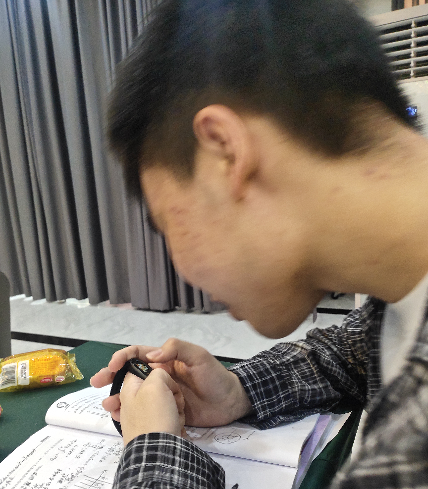

这是一篇想了很久的文章，在高中我建好最初版blog的时候，就想写了。只不过由于时间着实紧张，暑假时候也没有心思去写，所以就等到开学之后了。

# 序章
让我看看，我在高考之前做了什么呢？为我之后留下了什么呢？

首先感谢我小学的老师，但时间过于长了，我已经淡忘了许多，只记得些许名字。。。。

## 进入中学
  那就从进入中学开始讲起吧。在进入中学之前，我的脾气是比较暴躁的，进入初中之后，我似乎脾气少了许多。在初二，我认识我的一位挚友，称他为Maxlen727吧，我和他算是比较合得来。还认识了一些很要好的朋友，关系持续到现在，以后仍会持续下去。我也接触到了一位神奇的英语老师，虽然英语教的比较差，但是比较会教做人，令人印象最深刻的就是：老师批评你怎么办，不要低头，一定要抬起头，对着他笑。抬头是一种态度。不是说其他老师教的不好，而是在这个初二，我的同学，我的老师，对我的影响是我认为大于初一和初三的。~~不敢说那位管理很严格的老师对我的塑造很少，她其实也非常的好~~

## 进入高中
  可惜没有在初中与小学开始写记录，在高中我才开始记录我的生活。不论是照片还是文字，虽然当时可能羞愧于记录，懒惰于动手，可是一旦记录下来，那便是之后最珍贵的财富。

  生而如此，我没得选。在高中，很多同龄人都会是一个接近标准的范式，学习、做题、吃饭、睡觉、~~放假~~。为了高考拼尽全力。这无需怪罪谁，在这样的系统下，每个人都是难以选择改变的。但这就意味着完全的枯燥，痛苦，无尽的挣扎吗？显然，这绝非正确的。每个人都有自己的动力：或许是为了出人头地，或许是沉迷于学习新知，提升自己的能力......。每个人也都有自己的乐子：或是今天做出了难题的喜悦，或许是今天老师没有拖堂，或许是与室友们在熄灯后聊了一会儿天，或许是终于等到了放假......

  我们不是孤单的，我们有关爱我们的老师，有亲切的同学们（虽然我们会有矛盾，会有冲突），还有爱我的亲人。本来想爆照的，但是为了保护隐私，还是算了。不管怎么说，他们是我活下去的最大动力，遇到他们是我的幸运。
  
  在高中，学习占据了大部分，那么生存仍要继续，压力常在，运动是我缓解压力的一个重要活动。我从高三开始，经常用晚上吃饭的时间去操场跑步，不仅让我压力得到了释放，而且让我的身体还算不错。

那么最后为我之后留下了什么呢。一个还算健康的身体，一个还算端正的三观，一些朋友，一些热爱。

# 序章·续
高考之后，任务仍未结束。我去参加了强基计划的培训，延迟了放假，同样也延迟了分别。在强基培训的时光虽然学不太懂，但与好友的陪伴仍然是难得的。

<!--    -->

很幸运，我能够参加入围强基线，同样很幸运，我通过了校测，更幸运的是给我分到了一个我可以接受的专业，也在强基的时候又认识了一个朋友。那么高考真正的结束了。那么属于自己的生命终于启动了。那么，更大的责任与不确定性也降临了。

# 整顿，再启程

那么我终于放假了，可以在家好好地懒惰一下了......

那么我回家了。

我在家里学开车，做家教，做那些我喜欢但没有时间做的事情，干各种各样的杂事。很奇怪，虽然我放假了，但是我还是好忙。在忙的同时，经常感觉自己很空洞，想要干好多事情，却什么都不想干，空空地批判自己。明明自己放假前有那么恢宏的愿景，到了放假面前，这些flag都不堪一击。那就，**休息一下吧**。

# 开学
好好好，我的假期永远是最短的一批。我高中的假期比其他班要少。到了大学，我的开学时间也比其他人早😅️。

不过，在大学也有很多的空闲时间，环境也比较好，我能够静得下心，来做一些事情，也是终于开始了这篇文章。

过去留下来了一堆烂摊子需要处理，也留下来了一些好东西。在这里我感觉未来是光明的，我可以干我想干的，我可以在迷茫的时候问周围人的帮助。不论如何，一切美好总是昨日沉醉，过去的事在现在看来总是一些经历，是宝贵的。淡淡苦涩才是今天滋味，以后的路一定是光明但艰难的，需要经受各种考验。

好了好了，今天就到这里为止。许个愿吧，希望未来能够不负期待。