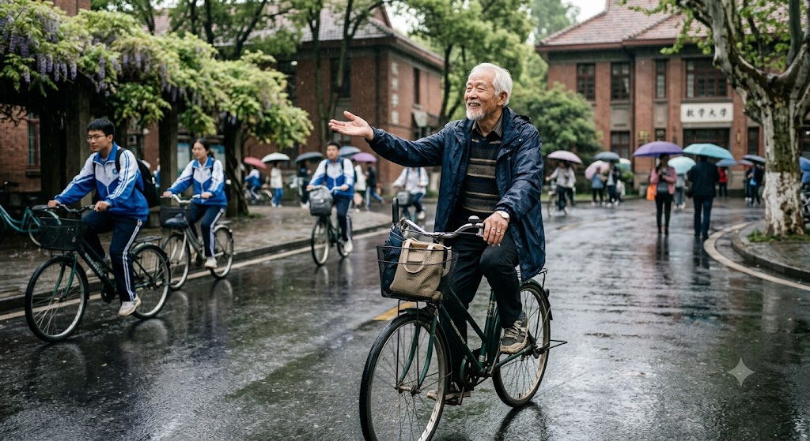

坏了，我发现我最近没有做什么很有意义的事情。感觉一直被带着走...

那我就记录一下最近干了什么吧。

## 军训

这么几天都在军训，时间为8.24~9.11，期间的一些活动也是挺有意思的。除了正常的训练，还有之前军训没有过的军理课、定向越野、拉练。期间偶尔到隔壁转一转，北大的环境让我觉得那里似乎更具有人文关怀，更加宜居，尤其是那边军训非常松，一周几乎只有3个小时。

## 一次交通事故引发的血案

有一天，我骑着共享单车在学校里面飞快地骑行。中间看到一位白发老人，慢慢地骑着车，伸出手，享受着雨滴落在手心。我不断地按铃铛，从他旁边穿过去。当我即将超车另外一个骑车的同学时，他向我这个方向转向。我急刹车，撞在了侧边，索性没有人受伤。那位老人说：“何必呢，赶什么呀？”，那个同学说：“你受伤了吗？你这么想先过去，我给你让车。”

我比较暴躁，我比较冲撞。做事情也没有什么安排，明明时间非常宽裕，我仍然骑得很快。最近几天尤其是这样，我感觉自己静不下心来专注地做一件事，虽然有大量的空闲时间，但是我并没有做什么事情，我容易分心，这是可以改变的吗？从那天开始，我骑车的速度慢了。

注： 图片由Gemini生成

## 沁阳市第一中学生存指南

虽然是看了[上海交通大学生存手册](https://survivesjtu.gitbook.io/survivesjtumanual)之后，想要写的。但是真正动工是班主任安排任务之后才开始的，现在写这个文档给后辈们看。~~真的好难写啊~~

对于那个
上海交通大学生存手册
，
虽然讲的是上海交大，但是写的东西，我还是感觉对很多大学生都是挺有用的。讲了一些大学干的事，让我了解了一些大学里的事情。

---

好了，就这样吧。
